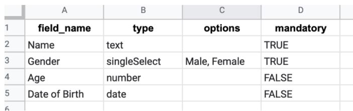

# Google Forms Clone

An application like Google forms where the following features are available:

* Users can create a form template by defining a form name & defining the form fields.

* The form fields are defined using a csv file (image attached below).
 
 The form fields will be defined by following parameters:

  * **`Field_name`**: Specifying the name of the field  

  * **`Type`**: The front-end will collect data as this type of entry  

    * Text  
    * Single select  
    * Number  
    * Date  
  * **`Options`**: Only for single select type, null for other types. Mentions values to show amongst which a single selection will be made.

  * **`Mandatory`**: Whether it is mandatory to enter data in that field or not (a condition for the front-end to check before form submission)

* Once a form template is created, users can fill the form multiple times creating multiple form entries
* Users can create, update, delete entries for a form template

---

## **Technologies**

* [Django](https://www.djangoproject.com/): Django builds better web apps with less code
* [DRF](www.django-rest-framework.org/): A powerful and flexible toolkit for building Rest APIs with Django
* Database used: [SQLite](https://www.sqlite.org/index.html) (for local testing)

---

## **API References**

### **Form**

This API gives the access to retrieve, update and delete a form template.

> ### GET /form/<int:form_template_id>

This endpoint is used to retrieve the form template data with `form_template_id`.

**Example Request**

```http
GET {site}/form/<int:form_template_id>
```

**Example Successful Response**

***Status Code***

`200`

***Body***

```json
{
    "form_template_id": 1,
    "form_name": "people",
    "form_fields": [
        {
            "field_id": 1,
            "field_name": "Name",
            "type": "text",
            "options": null,
            "mandatory": "TRUE",
            "form_template": 1
        },
        {
            "field_id": 2,
            "field_name": "Gender",
            "type": "singleSelect",
            "options": "Male, Female",
            "mandatory": "TRUE",
            "form_template": 1
        },
        {
            "field_id": 3,
            "field_name": "Age",
            "type": "number",
            "options": null,
            "mandatory": "FALSE",
            "form_template": 1
        },
        {
            "field_id": 4,
            "field_name": "Date of Birth",
            "type": "date",
            "options": null,
            "mandatory": "FALSE",
            "form_template": 1
        }
    ]
}
```

**Example Unsuccessful Response**

***Status Code***

`404`

> ### PUT /form/<int:form_template_id>

This endpoint is used to update the form template data with `form_template_id` and new form data.

**Example Request**

```http
PUT {site}/form/<int:form_template_id>
```

***Body***

```json
{
    "form_name": "people_updated",
    "form_fields": [
        {
            "field_name": "Name",
            "type": "text",
            "options": null,
            "mandatory": "TRUE"
        },
        {
            "field_name": "UpdatedAge",
            "type": "number",
            "options": null,
            "mandatory": "FALSE"
        },
        {
            "field_name": "Date of Birth",
            "type": "date",
            "options": null,
            "mandatory": "FALSE"
        }
    ]
}
```

**Example Successful Response**
***Status Code***

`201`

**Example Unsuccessful Response**

***Status Code***

`404`, `400`

> ### DELETE /form/<int:form_template_id>

This endpoint is used to delete the form template data with `form_template_id` and new form data.

**Example Request**

```http
DELETE {site}/form/<int:form_template_id>
```

**Example Successful Response**
***Status Code***

`200`

**Example Unsuccessful Response**

***Status Code***

`404`

### **Form Templates**

This API gives the access to get the form templates name and id and to create a new form template.

> ### GET /forms

This endpoint is used to get a list of all the form templates' `form_template_id` and `form_name`.

**Example Request**

```http
GET {site}/forms
```

**Example Successful Response**
***Status Code***

`200`

***Body***

```json
[
    {
        "form_template_id": 1,
        "form_name": "people"
    }
]
```

> ### POST /forms

This endpoint is used to create a new form template with relevant data.

**Example Request**

```http
POST {site}/forms
```

***Body***

```json
{
    "form_name": "people",
    "form_fields": [
        {
            "field_name": "Name",
            "type": "text",
            "options": null,
            "mandatory": "TRUE"
        },
        {
            "field_name": "Gender",
            "type": "singleSelect",
            "options": "Male, Female",
            "mandatory": "TRUE"
        },
        {
            "field_name": "Age",
            "type": "number",
            "options": null,
            "mandatory": "FALSE"
        },
        {
            "field_name": "Date of Birth",
            "type": "date",
            "options": null,
            "mandatory": "FALSE"
        }      
    ]
}
```

**Example Successful Response**
***Status Code***

`201`

**Example Unsuccessful Response**

***Status Code***

`400`

### **Form Entry**

This API gives the access to retrieve a form entry(basically form response) with `form_entry_id`.

> ### GET /form_entry/<int:form_entry_id>

This endpoint is used to retrieve the form entry data with `form_entry_id`.

**Example Request**

```http
GET {site}/form_entry/<int:form_entry_id>
```

**Example Successful Response**

***Status Code***

`200`

***Body***

```json
{
    "form_entry_id": 1,
    "form_name": "people_updated",
    "form_field_answers": {
        "Name": "Pratyush",
        "UpdatedAge": "17",
        "Date of Birth": "11/11/11"
    }
}
```

**Example Unsuccessful Response**

***Status Code***

`404`

### **Form Entries List**

This API gives the access to retrieve all the form entries and to post a form entry for a form template.

> ### GET /form_entries/<int:form_template_id>

This endpoint is used to retrieve a list of all the form entries for a `form_template_id`.

**Example Request**

```http
GET {site}/form_entries/<int:form_template_id>
```

**Example Successful Response**

***Status Code***

`200`

***Body***

```json
[
    {
        "form_entry_id": 1,
        "form_template": 1
    }
]
```

**Example Unsuccessful Response**

***Status Code***

`404`

> ### POST /form_entries/<int:form_template_id>

This endpoint is used to create a new form entry for a form template with relevant form fields and responses.

**Example Request**

```http
POST {site}/form_entries/<int:form_template_id>
```

***Body***

```json
{
    "form_field_answers": [
        {
            "Name": "Pratyush"
        },
        {
            "UpdatedAge": 17
        },
        {
            "Date of Birth": "11/11/11"
        }
    ]
}
```

**Example Successful Response**
***Status Code***

`200`

**Example Unsuccessful Response**

***Status Code***

`404`, `400`

---

## **Local Setup**

* If you wish to run your own build, first ensure you have python3 globally installed in your computer. If not, you can get python [here](https://www.python.org/downloads/).

* Download [pip](https://pip.pypa.io/en/stable/installing/) and add it to the path

* Change your working directory to `google-forms-clone`

    ```bash
    cd path/to/google-forms-clone
    ```

* Create a new virtual environment inside `google-forms-clone` directory and activate that

    ```bash
    python -m venv env
    ```

    > ***NOTE***  
    > By default, this will **not** include any of your existing site packages.

    For activating or deactivating virtual env, take [this](https://github.com/orgs/IFlaunta/teams/iflaunta-team/discussions/1) for reference.

* Download all the dependencies

    ```bash
    pip install -r requirements.txt
    ```

    Use `pip3` if `pip` not working

* Make a `.env` file in this directory only and put the following

    ```bash
    DJANGO_SECRET_KEY = django-insecure-3a65@ycam887r2c69p=3st-_#s8k26t(-*h8@4ic_f1qo1*ow6
    DJANGO_DEBUG = True
    ```

  * While putting `DEBUG = False`, remember to modify `ALLOWED_HOSTS` (for just quick reference, modify as `ALLOWED_HOSTS = ['*']`)

  * For generating a Django ***SECRET_KEY***, many different sites are there. This [site](https://miniwebtool.com/django-secret-key-generator/) can be used for quick reference.


### Before proceeding further, make sure ```Directory``` looks like

```
google-forms-clone
├── env
├── forms_app
├── google_forms
|   ├── __init__.py
|   ├── settings.py
|   ├── asgi.py
|   ├── wsgi.py
|   └── urls.py
├── .env
├── .gitignore
├── csv_first.JPG
├── manage.py
├── README.md
└── requirements.txt
```

### For running Django Server

* Migrate to the database

    ```bash
    python manage.py makemigrations
    python manage.py migrate
    ```

    Use `python3` if `python` not working

    After this, you would see a new file named `db.sqlite3` in your parent folder

* Run server

    ```sh
    python manage.py runserver
    ```

---
